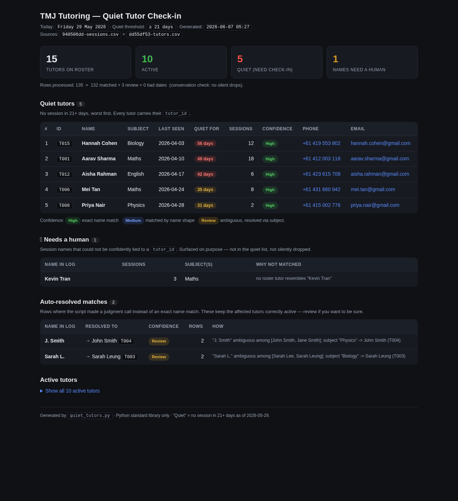
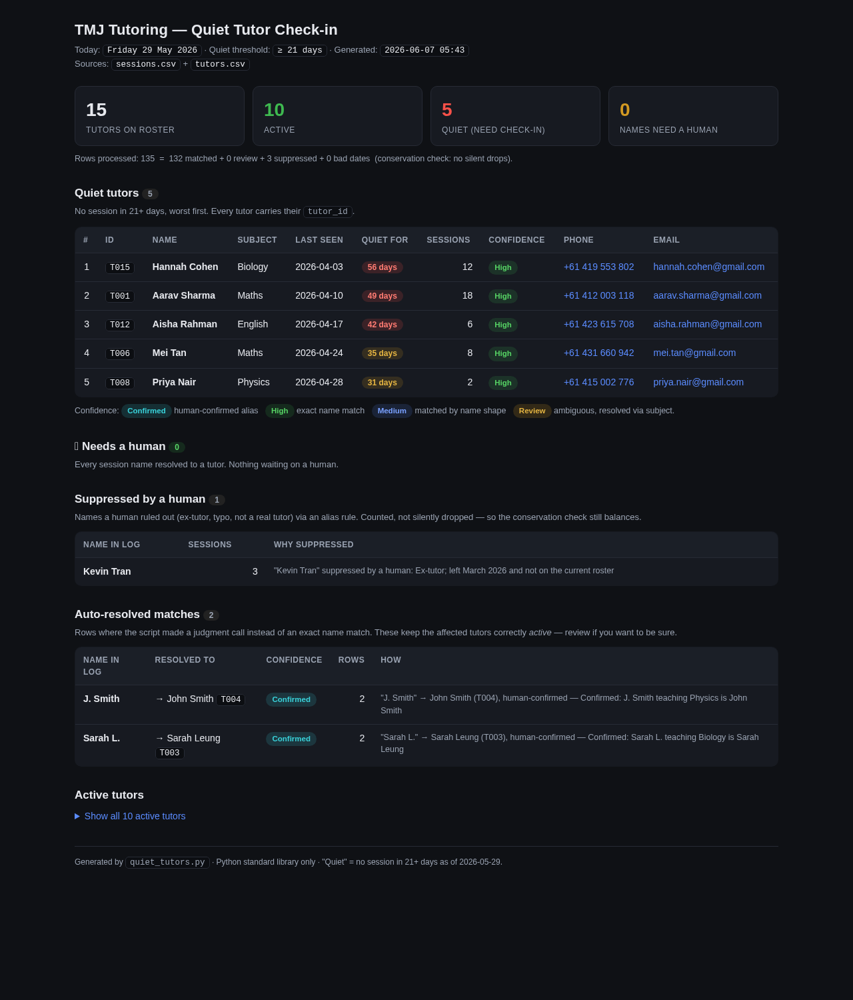

# TMJ Tutoring — Quiet-Tutor Finder

Finds tutors who haven't run a session in **3+ weeks** so an admin can check in on
them. Reads two CSVs, reconciles the messy names between them, and produces a
console report, an admin HTML dashboard, and two CSV artifacts.

## Run it

No dependencies — Python 3 standard library only. No `pip install`.

```bash
python3 quiet_tutors.py --out ./out
```

Optional flags:

```bash
python3 quiet_tutors.py \
  --sessions path/to/sessions.csv \
  --tutors   path/to/tutors.csv \
  --aliases  path/to/aliases.csv \
  --out      ./out
```

## What it produces

| File | What it is |
|------|------------|
| console output | The check-in list + contact details + anything needing a human |
| `out/report.html` | Self-contained admin dashboard (open in any browser) |
| `out/quiet_tutors.csv` | The quiet list with tutor_id + contact details |
| `out/review_unmatched.csv` | Session names that couldn't be tied to a tutor_id |

## The UI

`report.html` is a single self-contained file (inline CSS, no server, no JS deps).
It shows:

- **Summary cards** — roster size, active, quiet, needs-review counts.
- **Quiet tutors** — ranked by days silent, severity-coloured, with a confidence
  badge and tap-to-call / email links for each.
- **Needs a human** — session names not confidently matched to a tutor_id,
  surfaced (never silently dropped).
- **Suppressed by a human** — names ruled out via an alias rule (still counted).
- **Auto-resolved matches** — a transparency log of every non-exact match the
  script made and *why*, so a human can audit the fuzzy calls.
- **Active tutors** — collapsed by default.



## How matching works

Names don't line up cleanly between the two files (`J. Smith`, `Sarah L.`,
`O'Connor`). The script matches in tiers; the weakest tier used sets a tutor's
confidence badge:

1. **Exact** (normalised: case/punctuation/whitespace-insensitive) → **High**
2. **Structured fuzzy** on given/surname, allowing initials → **Medium**
3. **Subject tie-break** when an abbreviation is ambiguous between two real tutors
   → **Review** — e.g. `J. Smith` (Physics) → John Smith T004, not Jane Smith T005.

Anything that matches nothing confidently (e.g. `Kevin Tran`, not on the roster)
goes to the review list, not the quiet list.

**Conservation guarantee:** every session row is accounted for — matched, sent to
review, suppressed, or flagged as a bad date. Nothing is silently dropped.

## Learning from human edits (`aliases.csv`)

Fuzzy matching is a stopgap. The system *learns* by persisting human corrections
to `data/aliases.csv`, which is consulted **before** fuzzy matching on every run.
It's a deterministic, auditable lookup table — not a model — which is the right
call at this scale: it's instant, every decision is explainable, and a bad rule
is one line to delete.

Each row is one human decision:

| Column | Meaning |
|--------|---------|
| `raw_name` | the name as it appears in `sessions.csv` |
| `subject` | optional — set it to disambiguate; blank = applies to any subject |
| `tutor_id` | the confirmed tutor, **or** `IGNORE` to suppress a non-tutor name |
| `roster_fingerprint` | the `tutor_id`s that existed when the rule was confirmed |
| `note` | free text for the audit trail |

This adds a fourth, highest tier above exact match:

4. **Confirmed** — a human ruled on this name. Highest confidence.

`IGNORE` sends a name (ex-tutor, typo) to a **Suppressed** list instead of review,
so it stops nagging — but it's still counted, so conservation still balances.

**The staleness guard (why `roster_fingerprint` exists):** a confirmed alias must
never override a *genuinely new* tutor. If a tutor added since the rule was
confirmed now plausibly matches the alias's name — e.g. you confirmed
`M. Tan → T006`, then a real "Mark Tan" joins — the rule is auto-disabled and
re-surfaced for one-time re-confirmation. The learning store yields to roster
changes; exact-match always gets first crack at new people.

The loop in one line: **review entry → human edits `aliases.csv` → next run trusts
it (and the review pile shrinks).**

Try it on the sample data:

```bash
python3 quiet_tutors.py --aliases data/aliases.example.csv --out ./out_demo
```

`data/aliases.example.csv` confirms the two subject-tie-break calls (they upgrade
from *Review* to *Confirmed*) and suppresses `Kevin Tran` — review drops to 0,
suppressed shows 1, and the quiet list is unchanged.



## Result on the provided data

5 quiet tutors as of Fri 29 May 2026 (quiet = 21+ days):

| # | ID | Name | Last seen | Days |
|---|----|----|----|----|
| 1 | T015 | Hannah Cohen | 2026-04-03 | 56 |
| 2 | T001 | Aarav Sharma | 2026-04-10 | 49 |
| 3 | T012 | Aisha Rahman | 2026-04-17 | 42 |
| 4 | T006 | Mei Tan | 2026-04-24 | 35 |
| 5 | T008 | Priya Nair | 2026-04-28 | 31 |

See [`NOTE.md`](NOTE.md) for the decisions and what I'd confirm before production.
